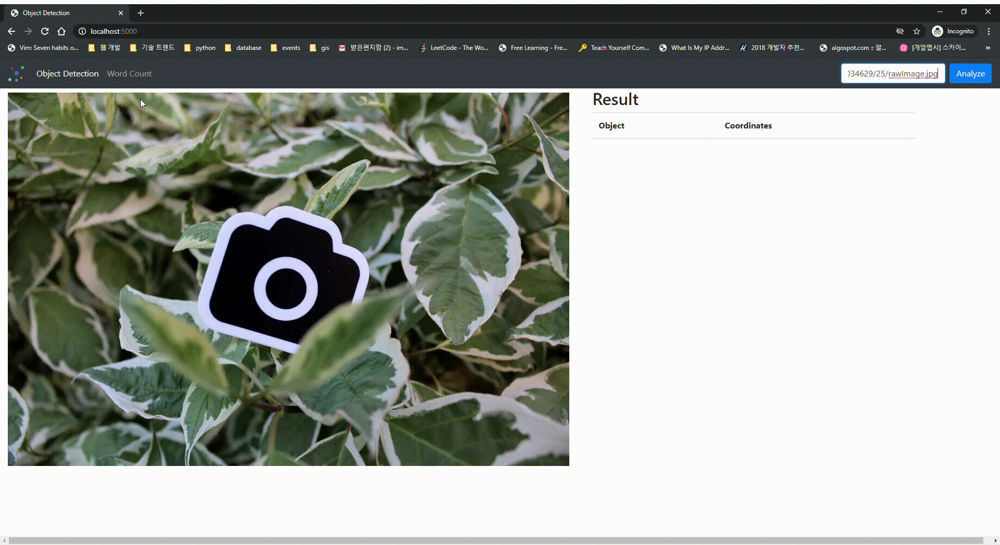
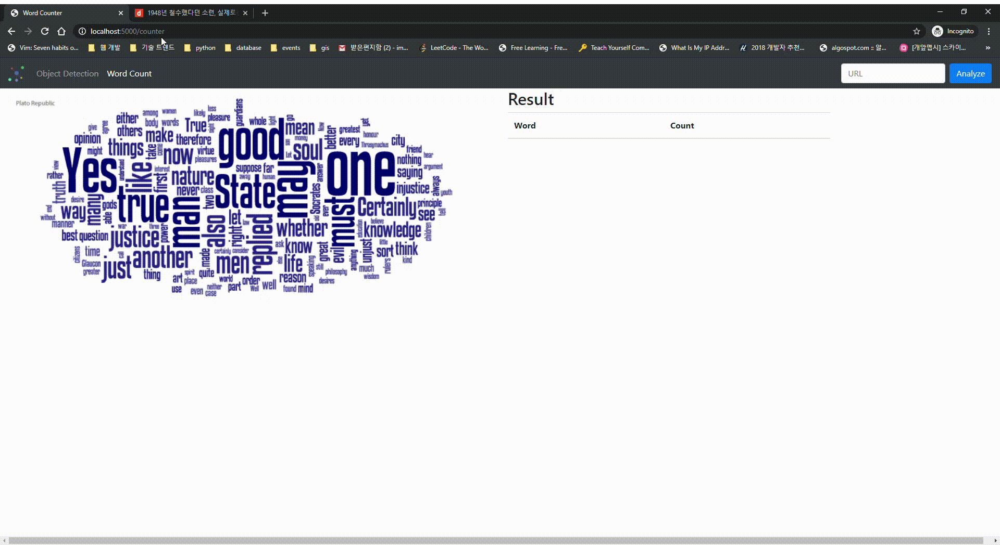
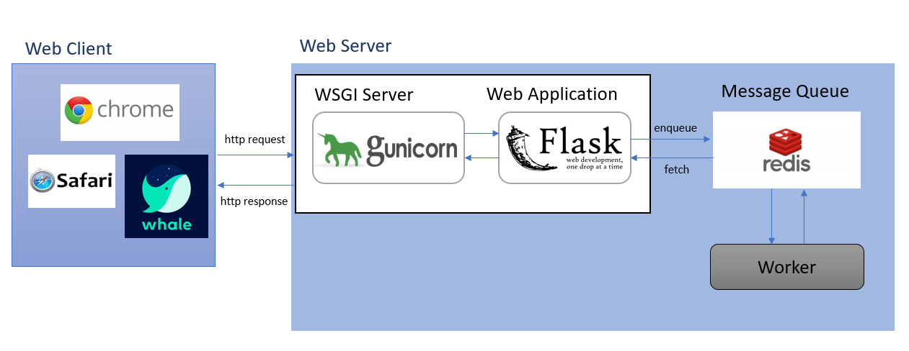

## 객체 탐지, Word Counter 웹 앱

- 객체 탐지
  - yolov3 네트워크의 pre-trained 모델 사용
  - 웹 상의 비디오 또는 이미지 파일 링크를 전달 받아 객체 탐지 실행



- 워드 클라우드
  - 한글 형태소 분석을 위해 konlp 의 Okt 모델을 사용
  - wordcloud 라이브러리를 사용해 wordcloud 이미지 생성




### System Architecture




### 사용 라이브러리

- gunicorn==20.0.4
  - WSGI 서버로 사용
- Flask==1.1.2
  - Web Application 용도로 사용
- opencv-contrib-python==4.2.0.34
  - 객체 탐지 알고리즘 사용을 위해 사용
- imageio==2.8.0, Pillow==7.1.2
  - 이미지, 영상 데이터 처리를 위해 사용
- requests==2.23.0, beautifulsoup4==4.6.0, lxml==4.5.1
  - 한글 형태소 분석을 위해 웹 상의 데이터를 파싱하기 위해 사용
- konlp==0.5.2, worcloud==1.7.0
  - 한글 형태소 분석 및 워드 클라우드 이미지 생성을 위해 사용
- redis==3.5.3, rq==1.4.2
  - redis와 연동해서 `worker` 를 실행하기 위해 사용


### 설치

- docker 기반

  ```bash
  # 서비스 실행
  docker-compose up
  ```

- 로컬 설치 (리눅스)

  ```bash
  # yolov3 모델 다운로드
  ./scripts/yolov3_download.sh
  
  # konlp 설치를 위한 jre 설치
  sudo apt-get install default-jre
  
  # 가상 환경 세팅 (optional)
  python -m venv venv
  source venv/bin/activate
  
  # 파이썬 라이브러리 설치
  pip install -r requirements.txt
  
  # redis 실행 (docker 기반)
  ./scripts/redis.sh
  
  # web server 실행
  python app.py
  
  # worker 실행
  python worker.py
  ```


